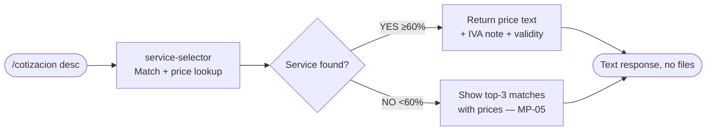
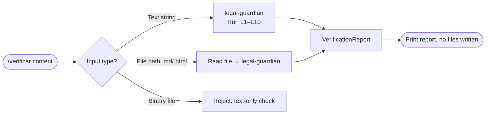
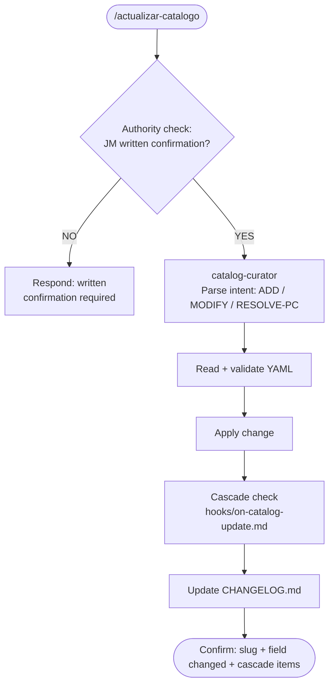

# Flow Map — MetodologIA Proposal Engine
# BMAP v1.0 · 2026-03-29
# Backend-for-Frontend: slash commands are thin facades; proposal-conductor is the BFF

---

## 1. System Topology

```
┌─────────────────────────────────────────────────────────────────────────┐
│  USER INPUT LAYER                                                        │
│  /propuesta · /cotizacion · /catalogo · /verificar · /actualizar-catalogo│
└────────────────────┬────────────────────────────────────────────────────┘
                     │ thin dispatch (command = input validator only)
                     ▼
┌─────────────────────────────────────────────────────────────────────────┐
│  BFF LAYER — proposal-conductor (orchestrator + gate enforcer)          │
│  • Accepts any-quality input                                             │
│  • Owns session cache (.proposal-state.json)                            │
│  • Enforces pipeline order: never skip legal gate                       │
│  • Dispatches to specialized agents via data contracts                  │
└────────────────────┬────────────────────────────────────────────────────┘
                     │
      ┌──────────────┼───────────────────┐
      ▼              ▼                   ▼
  input-         service-           catalog-
  interpreter    selector           curator
  (normalize)    (match+route)      (edit mode)
      │              │
      └──────┬───────┘
             ▼
         proposal-
          writer
         (content)
             │
             ▼
         legal-
         guardian ←── HARD GATE (BLOCKED → 3 paths, see §4)
             │
             ▼
         format-
         producer
         (10 files)
             │
             ▼
       delivery summary
       (conductor output)
```

---

## 2. Command → Agent Dispatch Table (BFF Routing)

| Command | Entry Agent | Secondary Agents | Output |
|---------|-------------|-----------------|--------|
| `/propuesta [desc]` | `proposal-conductor` | input-interpreter → service-selector → proposal-writer → legal-guardian → format-producer | 10 files + delivery summary |
| `/cotizacion [svc] [client]` | `service-selector` | (direct, no writing) | Price estimate text, no files |
| `/catalogo [filter]` | `catalog-curator` (list mode) | (none) | Formatted service table |
| `/verificar [content\|file]` | `legal-guardian` | (direct) | VerificationReport only |
| `/actualizar-catalogo` | `catalog-curator` (edit mode) | (none, + cascade) | Updated YAML + cascade log |

**BFF contract:** Every command passes raw input to its entry agent. The entry agent is responsible for normalization — commands are NOT responsible for validating field completeness.

---

## 3. Full Pipeline: `/propuesta` Flow

```mermaid
flowchart TD
    A(["/propuesta input"]) --> B{Session cache\n.proposal-state.json\nloaded_at < 10min?}
    B -->|YES - skip catalog read| C[Layer 1b: load canonico.md only]
    B -->|NO| D[Layer 1a: load services.yaml +\nconditions.yaml + segments.yaml]
    C --> E
    D --> E[Layer 1.5: input-interpreter\nParse + score + normalize]

    E --> F{Confidence on\ncritical fields?}
    F -->|≥80%| G[Direct to service-selector]
    F -->|60–79%| H[Proceed with\n[ASSUMED] flags]
    F -->|40–59%| I[Smart defaults + confirm]
    F -->|20–39%| J[ONE clarifying question\nthen smart defaults]
    F -->|0–19%| K[Single warm question\nMP-06]

    H --> G
    I --> G
    J --> G

    G --> L[Layer 2a: service-selector\nMatch slug + segment + audience]
    L --> M{Match score?}
    M -->|≥60%| N[STANDARD mode]
    M -->|40–59%| O[STANDARD + flag]
    M -->|<40%| P[INNOVATION mode]

    N --> Q[Layer 2b: proposal-writer\nMinto Complete, bilingual]
    O --> Q
    P --> Q

    Q --> R[Layer 3: legal-guardian\nL1–L10 · W1–W7]
    R --> S{VerificationReport\nstatus?}

    S -->|APPROVED| T[Layer 4: format-producer\n10 files]
    S -->|APPROVED_WITH_WARNINGS| T
    S -->|BLOCKED| U{Which blocker?}

    U -->|L1-L2 L4-L5 L7 L10\nauto-fixable| V[Auto-fix + re-verify]
    U -->|L3 L8 L9\nmanual required| W[Return to user\nwith specific fix instructions]
    U -->|L6 out-of-scope\npromise| X[Route to INNOVATION mode\nroute_to_innovation: true]

    V --> R
    X --> P

    T --> Y[Layer 5: delivery summary\nfile paths + assumptions + POR CONFIRMAR]
    Y --> Z([Deliver to user])
```

---

## 4. BLOCKED Recovery Paths (legal-guardian → proposal-conductor)

| Blocker | Auto-fixable | Action |
|---------|-------------|--------|
| L1 price mismatch | YES | Replace with canonical; re-run legal check |
| L2 POR CONFIRMAR stated as confirmed | YES | Add conditional wrapper from CLAUDE.md |
| L3 wrong/missing guarantee clause | NO | Return to user: "Rewrite guarantee section using exact clause" |
| L4 wrong credit terms | YES | Replace with "100%, 6 months, non-transferable" |
| L5 result % without wrapper | YES | Wrap with "Indicative target:" |
| L6 out-of-scope promise | REDIRECT | Set `route_to_innovation: true` → Innovation mode |
| L7 red list word | YES | Replace word (substitution table in CLAUDE.md) |
| L8 unconfirmed credit chain | YES | Add "subject to current policy — consult ambassador" |
| L9 IAC B2C price | NO | Remove B2C price; offer nearest Tier 1 B2C alternative |
| L10 fixed USD | YES | Append "(indicative rate, subject to variation)" |

---

## 5. Data Contracts at Each Handoff

### Contract 1 — User input → input-interpreter

```
INPUT:  raw text (any quality — voice, Spanglish, incomplete)
OUTPUT: ProposalData skeleton {
  client: { name, company, industry },    // may be "[ASSUMED]"
  problem: string,                         // extracted or "[ASSUMED]"
  segment: "b2b" | "b2c",
  budget_signal: number | null,
  service_hint: string | null,
  language: "es" | "en",
  confidence: {
    problem: 0–100,
    segment: 0–100,
    client:  0–100
  }
}
NEVER BLOCK: always return something, even with [ASSUMED] values
```

### Contract 2 — input-interpreter → service-selector

```
REQUIRED: problem, segment, language
OPTIONAL: budget_signal, service_hint, client.industry
SERVICE-SELECTOR MUST HANDLE: missing budget_signal (infer tier), missing service_hint (score all services)
```

### Contract 3 — service-selector → proposal-writer

```
REQUIRED: service_slug, segment, audience_version, brand (BrandConfig), client
OPTIONAL: cobrand partner details (for cobrand mode)
MATCH SCORE: included as metadata; writer uses it to decide confidence of scope items
```

### Contract 4 — proposal-writer → legal-guardian

```
REQUIRED: full ProposalContent (i18n.es + i18n.en), services[], currency, payment_terms
LEGAL-GUARDIAN CHECKS: all 10 blockers across both ES and EN content
IMPORTANT: legal-guardian checks the RENDERED content — not the ProposalData structure
```

### Contract 5 — legal-guardian → format-producer

```
REQUIRED: VerificationReport.status = "APPROVED" | "APPROVED_WITH_WARNINGS"
HARD GATE: if status = "BLOCKED", proposal-conductor MUST NOT call format-producer
FORMAT-PRODUCER INPUT: full ProposalData + verified VerificationReport + brand config
```

### Contract 6 — format-producer → proposal-conductor (delivery)

```
manifest: {
  generated: string[],   // file paths successfully written
  skipped: string[],     // format not available (missing deps)
  failed: string[]       // attempted but errored
}
MIN ACCEPTABLE: total_generated >= 3 (2 × .md + verification report = zero-dep floor)
```

---

## 6. `/cotizacion` Flow (no-file BFF shortcut)



**BFF contract:** `service-selector` calls `catalog-query.js` with `action: "check_price"`. Returns formatted price string. No legal gate — prices shown are canonical reads only (no generated content to verify).

---

## 7. `/verificar` Flow (legal check only)



---

## 8. `/actualizar-catalogo` Flow (CATALOG EDIT MODE)



---

## 9. Session Hook Flows

### SessionStart hook → session-init.sh

```
1. Load catalog/services.yaml → count by tier
2. Grep [POR CONFIRMAR] → count active items
3. Write .proposal-state.json { loaded_at, tier_counts, pc_count }
4. Output to stdout → injected into Claude context:
   "Catalog loaded: 17 services (T1:5 T2:4 T3:8). Active [POR CONFIRMAR]: 6."
```

### PostToolUse(Write|Edit) hook → post-write-qa.sh

```
1. Check if written file is in outputs/
2. If yes: count propuesta_* files in session output dir
3. If count < 10: log "Incomplete output: N/10 files"
4. If any file contains "BLOCKED": log "Legal gate BLOCKED — check verification report"
```

---

## 10. Iteration Paths (user requests change after delivery)

| Change type | Re-run from | Re-run layers |
|-------------|-------------|---------------|
| Client name only | Layer 4 | Format regeneration only |
| Price update | Layer 3 | Legal gate + all formats |
| Service change | Layer 2a | Selector → writer → legal → formats |
| Language flip | Layer 4 | Format regeneration only (content already bilingual) |
| Branding change | Layer 4 | Brand resolver + format regeneration |
| Scope item add/remove | Layer 2b | Writer → legal → formats |
| Full restart | Layer 1.5 | Full pipeline |

---

## 11. Agent Unavailability Fallback Table

| Agent down | Fallback |
|------------|---------|
| input-interpreter | Conductor runs MP-01 through MP-06 directly |
| service-selector | Conductor prompts user for service slug, proceeds |
| proposal-writer | Conductor uses SKILL.md Layer 2 inline |
| legal-guardian | Conductor runs verify-legal.js CLI directly |
| format-producer | Conductor generates .md + verification report manually |
| catalog-curator | Conductor edits YAML directly with read/validate/write steps |
